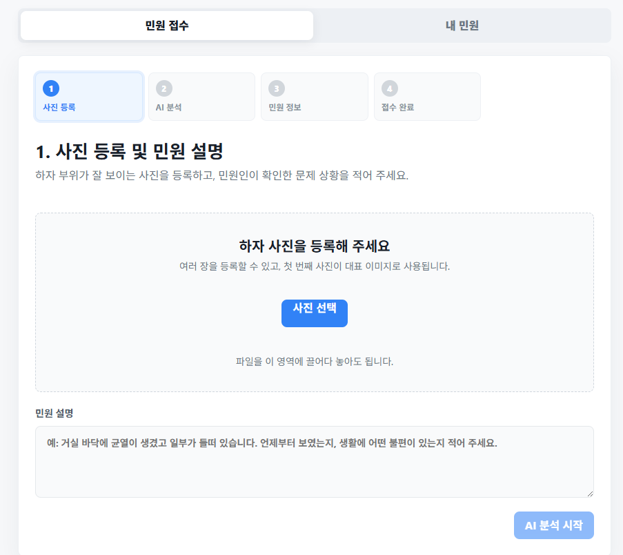
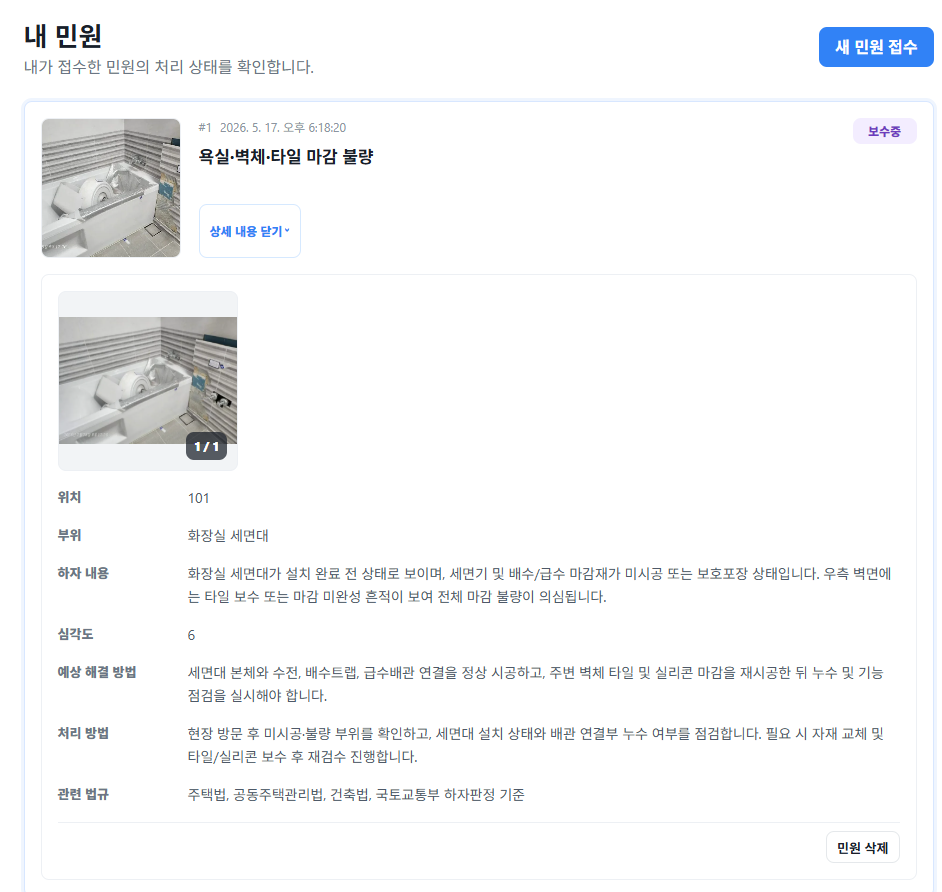
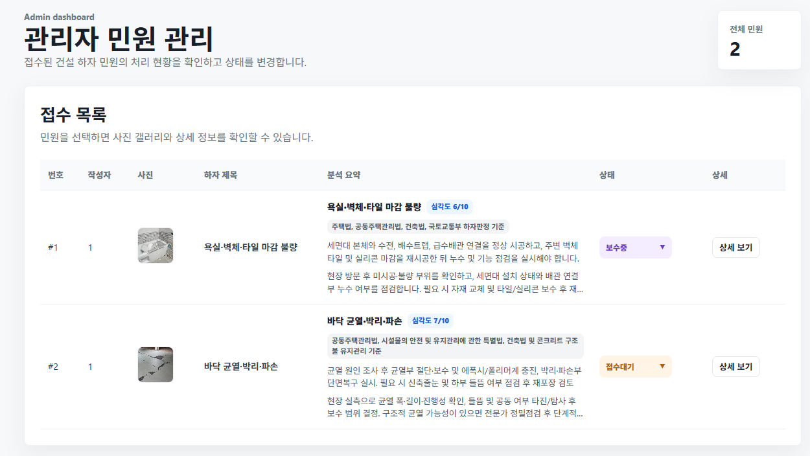
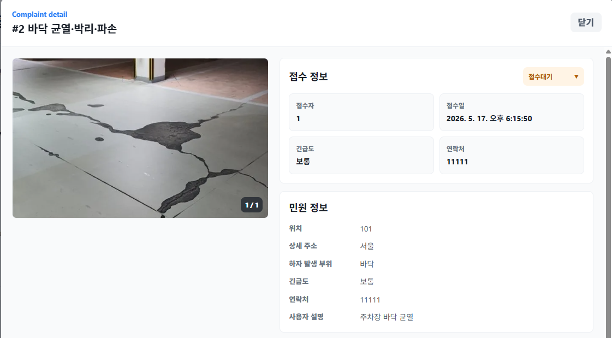
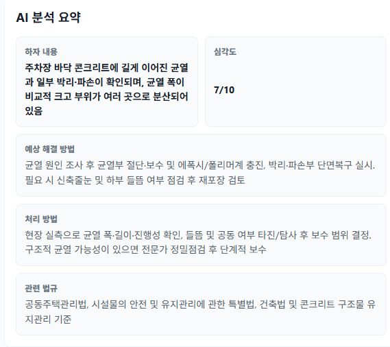

# AI 건설 하자 민원 응대 및 관리 시스템

사진을 기반으로 건설 하자를 AI가 분석하고, 민원 접수부터 관리자 처리까지 이어지는 민원 관리 시스템입니다.

## 사용자 기능

### 민원 접수

하자 사진을 등록하고 민원 설명을 입력한 뒤, AI 분석을 통해 접수에 필요한 하자 정보를 확인합니다.

### 내 민원 확인

사용자가 접수한 민원의 처리 상태를 확인하고, 상세 내용을 펼쳐 사진과 분석 결과를 함께 조회할 수 있습니다.

## 관리자 기능

### 전체 민원 관리

관리자는 접수된 전체 민원을 목록으로 확인하고, 하자 제목과 분석 요약, 처리 상태를 한눈에 확인할 수 있습니다.

### 민원 상세 관리

민원을 선택하면 첨부 사진, 접수 정보, 민원 정보, 연락처를 확인하고 처리 상태를 변경할 수 있습니다.

### AI 분석 요약 확인

AI가 분석한 하자 내용, 심각도, 예상 해결 방법, 처리 방법, 관련 법규를 구분해서 확인할 수 있습니다.

